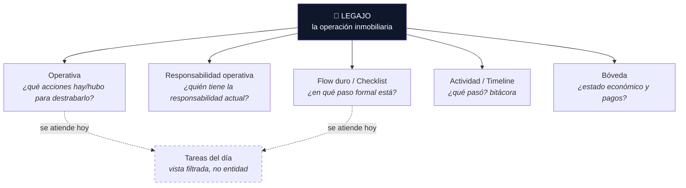
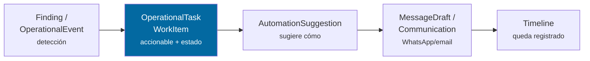
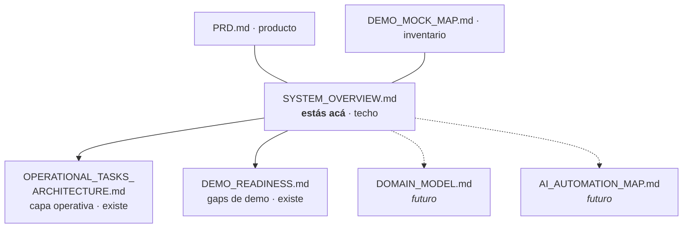

# Panel de Escribanías — Mapa del sistema

> **Documento techo / puerta de entrada.** Si llegás nuevo al proyecto, empezá acá.
> Es didáctico y corto: explica *qué es cada cosa y cómo se relacionan*, no cómo está implementado.
> El detalle vive en los documentos enlazados abajo.

---

## 1. Tesis del producto

No estamos construyendo un **Trello manual para escribanos**. Estamos construyendo una **capa operativa
accionable del legajo**: el sistema (reglas, eventos, IA) detecta condiciones y propone qué hacer; el humano
decide y ejecuta.

Frase guía: **event-informed, task-driven.**
Los eventos informan; las tareas, con estado e identidad, son lo accionable.

---

## 2. El legajo y sus capas

Un **legajo** (`operación`, `MP-XXXXXX`) es la unidad central. Todo lo demás son capas que lo describen desde un
ángulo distinto. Ninguna capa escribe sobre otra: cada una responde una pregunta diferente.



**Regla de oro:** crear/completar algo en una capa **no** muta otra. Una tarea operativa completada no cambia el
responsable actual ni el estado del flow. (Ver reglas no negociables en
[`OPERATIONAL_TASKS_ARCHITECTURE.md` §5](OPERATIONAL_TASKS_ARCHITECTURE.md).)

---

## 3. Glosario de una línea

| Concepto | Qué es | Qué NO es | Dónde se ve hoy | Detalle |
|---|---|---|---|---|
| **Legajo / Operación** | La operación inmobiliaria completa | — | Toda la app | PRD |
| **Flow duro / Checklist** | Pasos formales estructurados del proceso | Tareas custom | `op.estado`, HITOS, tab Actividad | — |
| **Responsabilidad operativa** (antes "línea de pases" / "pelota"; legacy en código) | Quién debe actuar ahora, cómo llegó esa responsabilidad ahí y por qué actor estamos esperando | Fuente de verdad del checklist, documento, OperationalTask ni timeline | Pill responsable + popover (`SoccerBloqueoTrigger`, legacy) | UI_SEMANTIC §1 |
| **OperationalEvent** | Hecho/detección/registro inmutable | Algo con estado que evoluciona | *No implementado* | OP_TASKS §10 |
| **OperationalTask / WorkItem** | Unidad **accionable con estado** (pending/done/cancelled) | Un seguimiento manual a secas | Tab Operativa, Tareas del día | OP_TASKS §3.2 |
| **`follow_up`** | Un **subtype** de OperationalTask | El modelo base | Badge "Seguimiento" | OP_TASKS §5.7 |
| **Tareas del día** | **Vista filtrada** de lo accionable para hoy | Un almacén / fuente de verdad | Dashboard | OP_TASKS §7 |
| **Operativa** | Memoria accionable del legajo (todas sus tasks) | El checklist ni la bitácora | Tab Operativa | OP_TASKS §9 |
| **Actividad / Timeline** | Registro narrativo/auditoría de lo ocurrido | Fuente de verdad operativa | Tab Actividad | OP_TASKS §10.8 |
| **Bóveda** | Estado económico, hitos de pago, trazabilidad financiera | — | Tab Bóveda | PRD (modelo económico) |
| **AutomationSuggestion** | Acción sugerida por sistema/IA, asociada a una task | La ejecución de la acción | *No implementado* | OP_TASKS §3.3 |
| **MessageDraft / Communication** | El mensaje concreto a enviar/enviado | La tarea ni la sugerencia | *No implementado* | OP_TASKS §3.4 |

---

## 4. La confusión más probable: Actividad vs Operativa vs Bóveda

Las tres parecen "cosas que pasaron / hay que hacer en el legajo". No lo son:

| | Pregunta que responde | Mutable | Acciones |
|---|---|---|---|
| **Actividad** | ¿Qué pasó? (narrativa/auditoría) | No (append-only) | Solo leer/exportar |
| **Operativa** | ¿Qué hay que hacer / se hizo para destrabar? | Sí (estado) | Completar, cancelar, reabrir |
| **Bóveda** | ¿Cuál es el estado económico? | Sí (eventos económicos) | Consultar/auditar pagos |

Si algo es **accionable y tiene estado** → Operativa.
Si es **un registro de algo que ocurrió** → Actividad.
Si es **dinero/hitos económicos** → Bóveda.

---

## 5. La cadena operativa (presente y futuro)



**Hoy solo existe la `OperationalTask`** (creada manualmente, `subtype: follow_up`, `origin: manual`). El resto de
la cadena está documentado pero no implementado. Cada flecha es una **decisión propia** (humana o de negocio):
nada salta a la siguiente etapa sin pasar por la tarea, que da contexto y trazabilidad.

---

## 6. Niveles de automatización (escalera, dónde estamos)

```
1. Manual ........................ el humano crea la tarea          ◀── HOY
2. IA sugiere .................... IA propone, humano crea
3. IA crea tarea ................. IA crea la OperationalTask
4. IA prepara borrador .......... IA arma MessageDraft, no envía
5. IA envía con aprobación ....... humano aprueba el envío
6. IA automatiza bajo riesgo ..... casos preaprobados, sin humano
```

**Principio:** ningún nivel salta la unidad operativa ni la aprobación humana en casos sensibles. La IA detecta y
sugiere; no manda WhatsApp directo. (Desarrollo completo → futuro `AI_AUTOMATION_MAP.md`.)

---

## 7. Anti-patterns

No se duplican acá — la fuente viva está en
[`OPERATIONAL_TASKS_ARCHITECTURE.md` §9.7 y §10.10](OPERATIONAL_TASKS_ARCHITECTURE.md). En una línea:

- Construir un Trello manual para escribanos.
- "Todo es timeline" / "todo es event" (los dos extremos).
- `follow_up` como entidad base.
- IA mandando WhatsApp sin unidad operativa ni aprobación.
- **Backend diseñado copiando componentes React** (la UI es una vista, no el modelo de dominio).

---

## 8. Mapa de documentación



- **`SYSTEM_OVERVIEW.md`** (este) — el plano. Puerta de entrada.
- **`OPERATIONAL_TASKS_ARCHITECTURE.md`** — la capa operativa en profundidad (Event/Task/Automation, reglas, anti-patterns).
- **`DEMO_READINESS.md`** — qué falta para una demo 100% funcional, priorizado.
- **`PRD.md`** — requisitos de producto, modelo económico, vocabulario controlado.
- **`DEMO_MOCK_MAP.md`** — inventario de rutas, datos mock y modelo Bóveda ("qué existe hoy").

### Siguiente nivel de documentación (futuro, no desarrollado)

Se crearán **cuando** se decida encarar backend o profundizar IA — no antes, para no sobre-documentar:

- **`DOMAIN_MODEL.md`** — entidades de dominio backend-ready: qué representa cada una, qué NO, relaciones, qué
  pantalla la consume. Decopla el dominio de la UI actual.
- **`AI_AUTOMATION_MAP.md`** — matriz de IA por etapa del flow (condición → event → task sugerida → suggestion →
  aprobación → registro) y desarrollo completo de los niveles de automatización.
